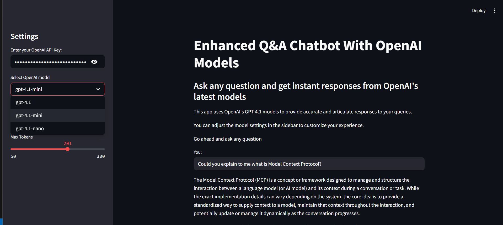

## OUTPUTS



## Setup and Installations.

1. Create a `venv`

```bash
conda create -p venv python==3.10 -y
```

- Activate the environment.

```bash
conda activate venv/
```

2. Install the dependencies

```bash
pip install -r requirements.txt
```

3. Run the project

```bash
streamlit run openai_chatbot.py
```
