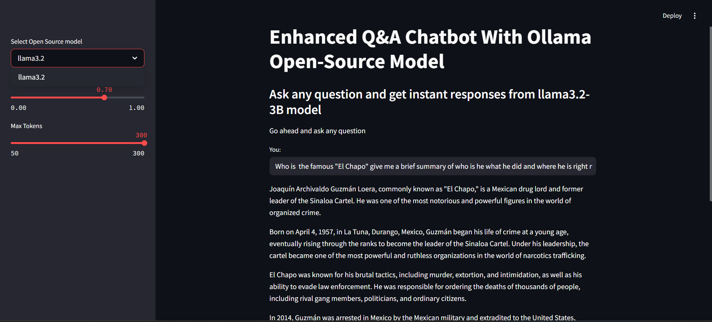
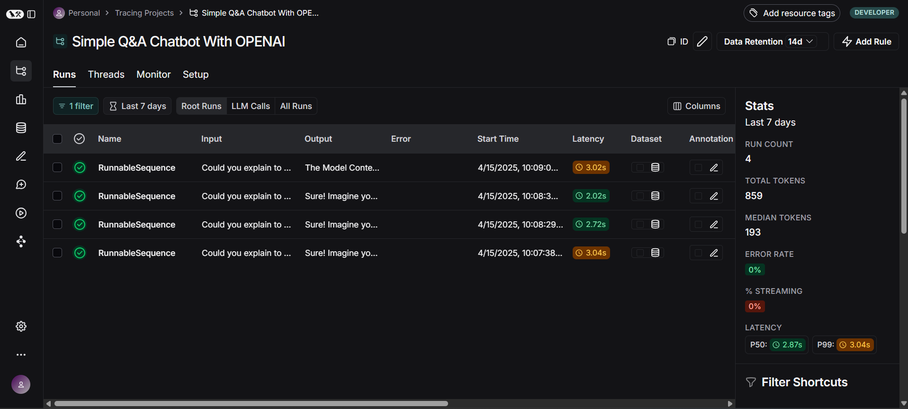

# 🧠 Enhanced Q&A Chatbot with OpenAI & LLaMA3

- This project is a smart and flexible chatbot built using `OpenAI’s latest GPT-4.1 models` — including `gpt-4.1`, `gpt-4.1-mini`, and `gpt-4.1-nano` — alongside an optional `open-source version` powered by `LLaMA3.2-3B` via `Ollama`.

- It allows users to ask questions and receive instant, high-quality responses using either OpenAI’s frontier models or the LLaMA3 alternative. The app also integrates with LangChain for chaining logic and LangSmith for real-time tracing, debugging, and cost tracking.

- A simple interface built with Streamlit lets users toggle between models and customize their chat experience with ease.

#### 🧠 Switching Between Models

- From the sidebar in the app, you can choose between:

- gpt-4.1 (best quality, higher latency/cost)

- gpt-4.1-mini (balanced)

- gpt-4.1-nano (fastest, lowest cost)

- llama3.2-3B (via Ollama – for open-source enthusiasts)

#### 📊 Debugging & Tracing with LangSmith

- LangSmith integration gives you:

- Real-time chain and agent tracing

- Token usage and cost breakdowns

- Easy debugging of LangChain pipelines

#### ⚙️ Tech Stack

- Python 🐍

- Streamlit 📺 — for interactive frontend

- OpenAI API 🔐 — for GPT-4.1 models

- Ollama 🦙 — for running LLaMA3 open-source models locally

- LangChain 🧱 — for chaining and context memory

- LangSmith 📊 — for tracing, debugging, and token/cost insights

- dotenv 🔑 — for securely managing API keys and environment variables

## OUTPUTS

#### Using OpenAI Frontier Model


#### Using Ollama Open-Souce Model



#### Tracking, Debugging and Token/Cost Usage using LangSmith



## Setup and Installations.

1. Create a `venv`

```bash
conda create -p venv python==3.10 -y
```

- Activate the environment.

```bash
conda activate venv/
```

2. Install the dependencies

```bash
pip install -r requirements.txt
```

3. Run the project

```bash
streamlit run openai_chatbot.py
```

OR

```bash
streamlit run ollama_chatbot.py
```

## 👨🏽‍💻 Author

### Built with ❤️ by Nick Bwalley.

### Kenya-based AI & ML Engineer passionate about Generative AI and open-source.
